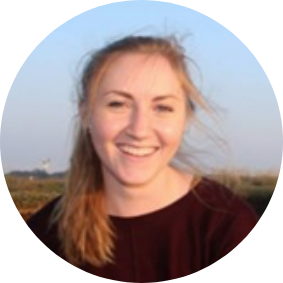

\  

## Instructors

\  

#### Alex Douglas
<div style= "float:left;position: relative; top: 5px;">
```{r, out.width = "200px", out.extra='style="padding:30px;"', echo = FALSE}
knitr::include_graphics("images/alex.png")
```
</div>

\ 

Alex is a Reader in Biostatistics at the University of Aberdeen and has been teaching (and learning) R for the last 17 years. 

- Email: a(dot)douglas(at)abdn(dot)ac(dot)uk
- Web: https://www.abdn.ac.uk/people/a.douglas/
- Twitter: https://twitter.com/Scedacity
- GitHub: https://github.com/alexd106

\  

\  

#### Mark Emmerson  
<div style= "float:left;position: relative; top: 5px;">
```{r, out.width = "200px", out.extra='style="padding:30px;"', echo = FALSE}
knitr::include_graphics("images/emmerson_cropped.png")
```
</div>

\  

Mark is a Professor of Biodiversity at Queen's University Belfast. He has been using and teaching R for many years. 

- Email: m(dot)emmerson(at)qub(dot)ac(dot)uk
- Web: https://pure.qub.ac.uk/en/persons/mark-emmerson
- Twitter: https://twitter.com/meecoprof

\  

\  

#### Maarten Blaauw
<div style= "float:left;position: relative; top: 5px;">
```{r, out.width = "200px", out.extra='style="padding:30px;"', echo = FALSE}

```
</div>

\  

Maarten is a Reader in Palaeoecology at Queen’s University Belfast researching age-modelling. He has been using and teaching R for 18 years. 

- Email: maarten(dot)blaauw(at)qub(dot)ac(dot)uk
- Web: https://pure.qub.ac.uk/en/persons/maarten-blaauw
- GitHub:  https://github.com/Maarten14C

\  

\  

## Administrative Contacts  

\  

#### Izzie Buchanan
<div style= "float:left;position: relative; top: 5px;">
```{r, out.width = "200px", out.extra='style="padding:30px;"', echo = FALSE}

```
</div>

\  

Izzie is the QUADRAT Partnership Co-ordinator.

- Email: quadrat(at)abdn(dot)ac(dot)uk
- Twitter: https://twitter.com/quadratdtp


